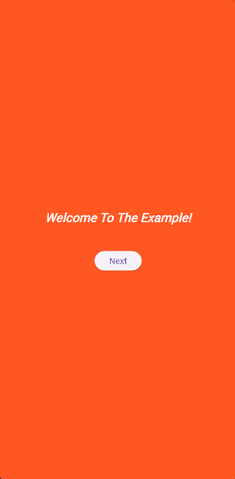
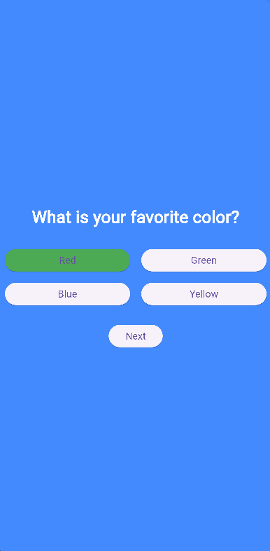
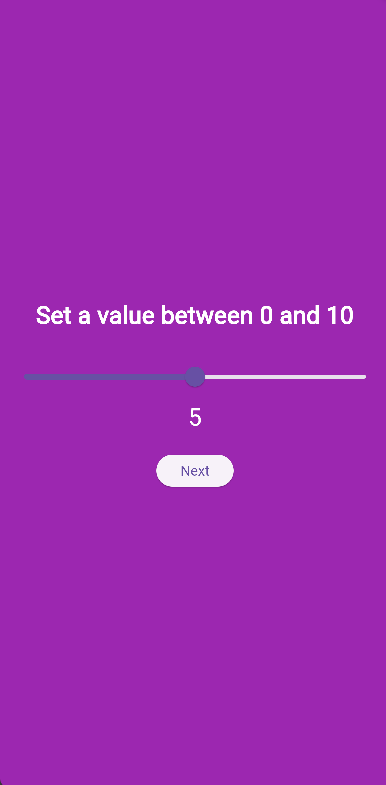

# Prompts
Prompts is a Flutter UI control designed to guide users through a series of prompts and collect their responses.

<div style="display: flex; flex-direction: row;">
    
    
    
</div>

## Demo Video

Check out the [demo video](https://drive.google.com/file/d/1vcCfNifq--Y-Q3YEHC2OnsJUnLAkmmHV/view?usp=sharing) for Prompts.

## Features
- Interactive prompts: Information, Yes/No, Text input, Numeric input with more to come like multiple choice & sliders.
- Responsive UI design.
- Easy back and forth navigation between prompts.
- Valid input verification.
- Animated Transitioning between prompts.
- Background Color Seleciton
- Compatible with Web, IOS, Android, or anywhere else flutter runs!

## Getting Started

To integrate Prompts into your Flutter project, follow these simple steps:

**Clone the Repository**: Clone the Prompts repository to your local machine using the following command:

   ```bash
   git clone https://github.com/mitch344/Prompts.git
```
**Add Files to Your Project**

Copy the `prompt_model.dart` and `prompt_view.dart` files from the cloned repository into your Flutter project. These files contain the necessary components for implementing Prompts.

**Usage**

Use the `PromptModel` and `PromptView` classes in your Flutter project as demonstrated in the example below.

**Acknowledgment**

Ensure to provide proper credit to the authors of Prompts in your project's documentation or about page.

## Example App
```dart
class ExampleScreen extends StatelessWidget {
  const ExampleScreen({Key? key}) : super(key: key);

  @override
  Widget build(BuildContext context) {
    final prompts = [
      PromptModel(
        text: 'Welcome To The Example!',
        type: PromptType.info,
        fontStyle: TextStyle(fontSize: 20, fontStyle: FontStyle.italic),
      ),
      PromptModel(
        text: 'What is your favorite color?',
        type: PromptType.multipleChoice,
        multipleChoiceOptions: ['Red', 'Green', 'Blue', 'Yellow'],
      ),
      PromptModel(
        text: 'Are you a Developer?',
        type: PromptType.yesno,
        fontStyle: TextStyle(fontSize: 18, fontWeight: FontWeight.normal),
      ),
      PromptModel(
        text: 'What is your Name?',
        type: PromptType.textbox,
        controller: TextEditingController(),
        fontStyle: TextStyle(fontSize: 16, fontWeight: FontWeight.bold),
      ),
      PromptModel(
        text: 'How many years?',
        type: PromptType.number,
        controller: TextEditingController(),
        fontStyle: TextStyle(fontSize: 22, fontWeight: FontWeight.w500),
      ),
      PromptModel(
        text: 'Great!',
        type: PromptType.info,
        fontStyle: TextStyle(fontSize: 20, fontStyle: FontStyle.italic),
      ),
    ];
    return PromptView(prompts: prompts , backgroundColor: Colors.blueAccent);
  }
}
